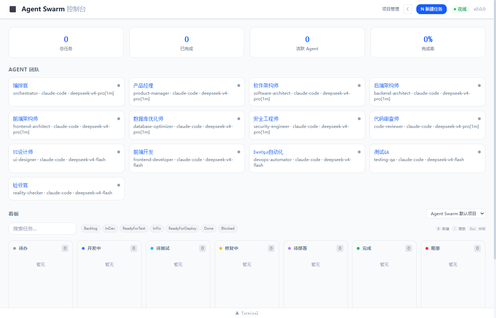
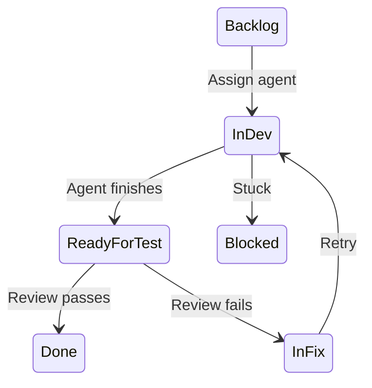
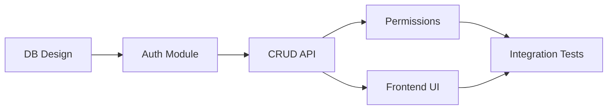
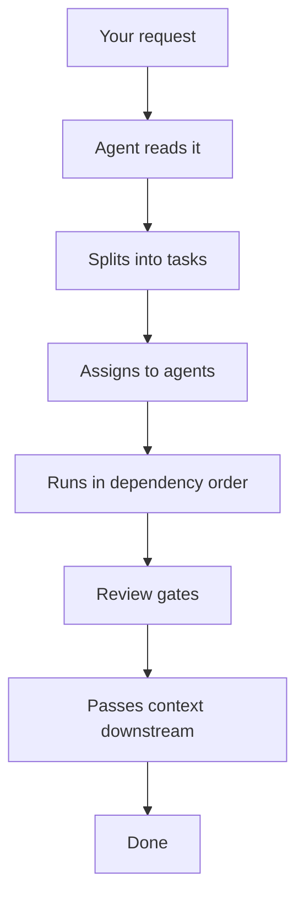
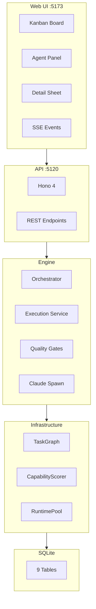

# Agent Swarm — Dark Factory

> **一个人审 AI 的代码是加班，12 个 AI 互相审是交付。**
>
> AI writing code isn't scary — code with no review is. That's what we fix.
> Cursor gives you one AI. We give you a team.

You write the spec. 12 agents split it up, write the code, and check each other's work — so you write specs, not code reviews.



[中文文档](README.zh-CN.md)

---

## Quick Start

### Prerequisites

| Component | Version | Notes |
|-----------|---------|-------|
| Node.js | ≥ 22 | [Download LTS](https://nodejs.org/) |
| pnpm | ≥ 11 | The startup script installs it automatically |
| Claude Code CLI | Latest | `npm install -g @anthropic-ai/claude-code` |
| API Key | — | Works with DeepSeek or any Anthropic-compatible API |

> **DeepSeek setup**: Set `ANTHROPIC_BASE_URL` and `ANTHROPIC_AUTH_TOKEN` in Claude Code's `settings.json`. Supported models: `deepseek-v4-pro[1m]`, `deepseek-v4-flash`.

### One-Click Start

**Windows**: Double-click `start.bat`. It handles Node.js, pnpm, the global `/swarm` skill, and starts the server.

**Mac/Linux**:
```bash
./start.sh
```

Open `http://localhost:5173` and you'll see 12 agents ready.

### Manual Start

```bash
pnpm install
pnpm dev          # API (:5120) + Web (:5173)
```

---

## Usage

### From Claude Code

In any project, type `/swarm` followed by what you want — works in VS Code, terminal, anywhere Claude Code runs:

```
/swarm Build a user management system with registration, login, and role management
```

What happens next:
1. It registers your project
2. An agent reads the request and breaks it into subtasks
3. Subtasks get handed out to the right agents
4. Agents run in parallel (up to 3 at once)
5. Each finished task goes through a review step
6. Code lands in your project directory

Open `http://localhost:5173` to see the board.

### From the Web Dashboard

- Click New Task, fill in a title and description
- Click the card, pick an agent, status changes to InDev
- Click Execute, the agent starts working
- When done, you'll see what it produced

### From the API

```bash
python3 -c "
import urllib.request, json
body = json.dumps({
    'project_id': '<ID>',
    'title': 'Build login API',
    'description': 'Implement user login with JWT...'
}).encode('utf-8')
req = urllib.request.Request('http://localhost:5120/api/auto', data=body, method='POST')
req.add_header('Content-Type', 'application/json; charset=utf-8')
resp = json.loads(urllib.request.urlopen(req, timeout=90).read())
print(resp)
"
```

> On Windows, use Python for API calls with non-ASCII text. Bash curl goes through GBK and corrupts UTF-8.

---

## Kanban Board



---

## The 12 Agents

| # | Role | Model | Group | Does |
|---|------|-------|-------|------|
| 1 | Orchestrator | pro | Planner | Reads the request, splits it into tasks |
| 2 | Product Manager | pro | Planner | Turns ideas into concrete specs |
| 3 | Software Architect | pro | Planner | Designs the overall structure |
| 4 | Backend Architect | pro | Generator | Writes APIs and data models |
| 5 | Frontend Architect | pro | Generator | Designs routes and component trees |
| 6 | Database Optimizer | pro | Generator | Queries, indexes, migrations |
| 7 | Security Engineer | pro | Evaluator | Checks for vulnerabilities |
| 8 | Code Reviewer | pro | Evaluator | Reviews code quality |
| 9 | UI Designer | flash | Generator | Visuals and interaction |
| 10 | Frontend Developer | flash | Generator | Components and state |
| 11 | DevOps Automator | flash | Generator | Scripts, CI, deployment |
| 12 | Test QA | flash | Evaluator | Tests and verification |

> 8 roles use `deepseek-v4-pro[1m]` (heavier thinking), 4 use `deepseek-v4-flash` (faster, cheaper). Each agent's `ANTHROPIC_MODEL` env var is stripped at launch so the `--model` flag reaches the API directly.

The prompt each agent receives is defined in [`execution-service.ts`](packages/server/src/engine/execution-service.ts). See [agent-team-reference.md](docs/agent-team-reference.md) for details.

---

## Review Gates

After an agent finishes, its output goes through 4 checks:

| Gate | When | What it does |
|------|------|-------------|
| Acceptance | Always | Matches output against the spec |
| Review | Larger tasks | Checks for logic bugs, perf issues, security holes |
| Simplify | Long outputs | Flags duplicate code |
| Learn | If anything fails | Records what went wrong for next time |

> All pass → Done. Anything fails → InFix with notes on what to fix.

---

## How Agents Are Prompted

Each agent gets a prompt built from 5 layers:

```
Layer 1: Who they are     ← Role and rules
Layer 2: How to work      ← Based on task complexity
Layer 3: Domain knowledge ← Matched to the task type
Layer 4: The task         ← What needs to be done
Layer 5: Output format    ← How to report back
```

### Domain knowledge by task type

| Domain | Triggers | What gets injected |
|--------|---------|-------------------|
| database | sql, query, migration | Migration patterns, indexing rules |
| api | rest, endpoint, backend | REST conventions, error formats |
| security | auth, login, password | Input validation, hashing |
| testing | test, qa, validation | Test coverage, edge cases |
| frontend | ui, component, react | State handling, browser testing |
| devops | ci, cd, deploy, docker | Scripting, rollback |
| performance | optimization, cache | Profiling, N+1 detection |
| architecture | design, system, module | Contracts, dependency review |

> Task types come from the orchestrator reading the request. If that fails, a keyword matcher extracts them from the task text.

---

## How It Works

### 1. Someone reads the request

An agent looks at what you typed and gives it a score (1-10) to decide how to tackle it.

### 2. It gets split up

Big requests become smaller tasks with dependencies:



### 3. Tasks are assigned and run

Agents pick up tasks they can handle. Complex tasks trigger a stricter workflow with separate review steps.

### 4. Results flow downstream

When a task finishes, its output is passed along to tasks that depend on it. The architect's API design becomes context for the backend dev.

### 5. Crashes are handled

- At most 3 agents run at once, with a pause between batches
- If a Claude Code process crashes, it reads the exit code to figure out why
- Transient failures get 2 retries before giving up

---

## The `/api/auto` Pipeline



---

## Architecture



### Tech Stack

| Layer | Tech |
|-------|------|
| Language | TypeScript 5.x |
| Runtime | Node.js 22+ |
| Frontend | React 19 + Vite 7 + Tailwind CSS 4 + @dnd-kit |
| Backend | Hono 4.x |
| Database | sql.js (SQLite in WASM, no install needed) |
| Agent Runtime | Spawns `claude` processes directly |
| Models | DeepSeek V4 Pro / Flash (Anthropic-compatible API) |

---

## Project Structure

```
packages/
├── shared/src/types/         # Shared types
├── server/src/
│   ├── engine/
│   │   ├── orchestrator      # Reads requests, splits into tasks, runs pipeline
│   │   ├── execution-service # Builds agent prompts, spawns Claude Code
│   │   ├── claude-spawn      # Spawn + retry + diagnostics
│   │   ├── quality-gate      # Post-execution review gates
│   │   ├── task-graph        # Task DAG with optimistic locking
│   │   ├── capability-scorer # Matches tasks to agents
│   │   ├── runtime-pool      # Concurrency control
│   │   ├── rate-limiter      # Rate limiting
│   │   └── circuit-breaker   # Failure isolation
│   ├── routes/               # REST API
│   ├── db/                   # SQLite schema + auto-seed
│   └── sse/                  # Server-sent events
├── web/src/
│   ├── components/kanban/    # Board, columns, cards
│   ├── components/tasks/     # Task creation, detail panel
│   └── pages/                # Pages
└── cli/src/                  # CLI tool
```

---

## API Reference

| Method | Path | Description |
|--------|------|-------------|
| GET | `/api/projects` | List projects |
| POST | `/api/projects` | Create project |
| GET | `/api/agents` | List agents |
| POST | `/api/agents` | Register agent |
| GET | `/api/tasks` | List tasks |
| POST | `/api/tasks` | Create task |
| PATCH | `/api/tasks/:id` | Update task (optimistic lock) |
| POST | `/api/tasks/:id/execute` | Execute task |
| **POST** | **`/api/auto`** | **Submit a request, does everything** |
| POST | `/api/orchestrate` | Analyze + split (doesn't execute) |
| GET | `/api/board` | Kanban view |
| GET | `/api/stats` | Statistics |
| GET | `/api/events` | SSE event stream |
| GET | `/api/health` | Health check |
| POST | `/api/kill-switch` | Emergency stop |

---

## Troubleshooting

### Port 5120 in use

```bash
# Windows
netstat -ano | findstr :5120
taskkill /pid <PID> /f

# Mac/Linux
lsof -ti:5120 | xargs kill -9
```

The server now auto-detects this and tries to recover. If it can't, it'll print the exact command to run.

### pnpm won't install

```bash
npm install -g pnpm
```

### Agent crashes with exit code -1

Usually one of:
1. `ANTHROPIC_AUTH_TOKEN` not set or wrong
2. `ANTHROPIC_BASE_URL` unreachable
3. Model name the API doesn't recognize
4. Too many Claude Code processes at once

Check `.claude/settings.json`.

### Adding a new agent role

1. [`seed.ts`](packages/server/src/db/seed.ts) — add `{ name, role, model }`
2. [`execution-service.ts`](packages/server/src/engine/execution-service.ts) — add role prompt
3. Restart

---

## Development

```bash
pnpm install
pnpm dev
pnpm typecheck
pnpm test
```

---

## License

MIT
