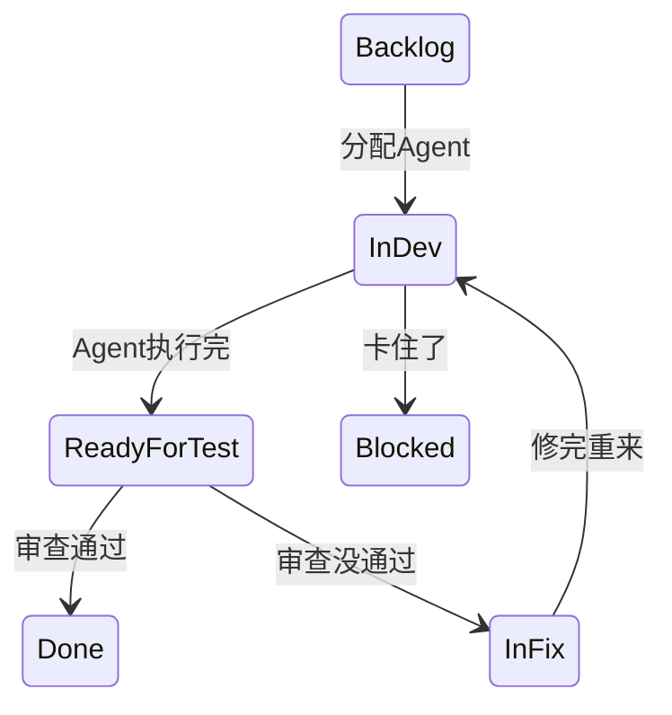
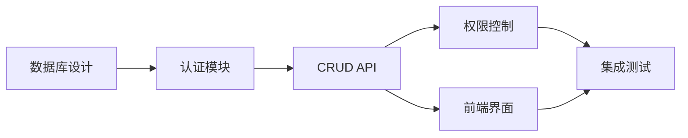
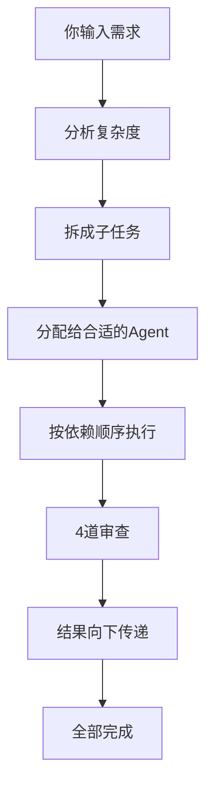
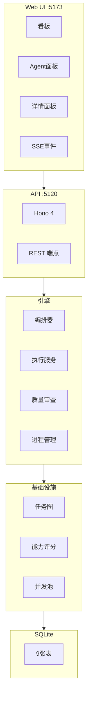

# Agent Swarm — Dark Factory

> 输入需求，12 个 Agent 帮你拆、写、审。

[](LICENSE)
[](https://www.typescriptlang.org/)
[](https://nodejs.org/)
[](https://react.dev/)
[](https://hono.dev/)

输入一句需求，12 个 Agent 自动拆分任务、写代码、互相审查。自带看板，VS Code 任何项目里都能用。


---

## 快速开始

### 环境要求

| 组件 | 最低版本 | 说明 |
|------|---------|------|
| Node.js | ≥ 22 | [nodejs.org](https://nodejs.org/) 下载 LTS |
| pnpm | ≥ 11 | 启动脚本自动装 |
| Claude Code CLI | 最新版 | `npm install -g @anthropic-ai/claude-code` |
| API Key | — | DeepSeek 或其他 Anthropic 兼容 API |

> **DeepSeek 配置**：在 Claude Code 的 `settings.json` 里设好 `ANTHROPIC_BASE_URL` 和 `ANTHROPIC_AUTH_TOKEN`。支持的模型：`deepseek-v4-pro[1m]`、`deepseek-v4-flash`。

### 启动

**Windows**：双击 `start.bat`。它会检查 Node.js、装好 pnpm、注册全局 `/swarm`，然后启动服务。

**Mac/Linux**：
```bash
./start.sh
```

打开 `http://localhost:5173` 就能看到 12 个 Agent。

### 手动启动

```bash
pnpm install
pnpm dev          # API (:5120) + Web 看板 (:5173)
```

---

## 怎么用

### 在 VS Code 里用

随便打开一个项目，输入：

```
/swarm 开发一个用户管理系统，支持注册、登录、角色分配
```

然后发生的事情：
1. 自动识别当前项目，注册到平台
2. 一个 Agent 读需求，拆成子任务
3. 子任务分给合适的 Agent
4. Agent 并行干活（最多 3 个同时跑）
5. 每个任务完成后走审查
6. 代码直接写进你项目里

打开 `http://localhost:5173` 看进度。

### 在网页看板操作

- 点「新建任务」，填标题和描述
- 点卡片详情，选个 Agent，状态变成 InDev
- 点「执行」，Agent 开始工作
- 完成后能看到它输出了什么

### 调 API

```bash
python3 -c "
import urllib.request, json
body = json.dumps({
    'project_id': '<ID>',
    'title': '开发登录API',
    'description': '实现用户登录功能...'
}, ensure_ascii=False).encode('utf-8')
req = urllib.request.Request('http://localhost:5120/api/auto', data=body, method='POST')
req.add_header('Content-Type', 'application/json; charset=utf-8')
resp = json.loads(urllib.request.urlopen(req, timeout=90).read())
print(resp)
"
```

> Windows 上别用 bash curl 传中文——bash 的 GBK codepage 会把 UTF-8 搞坏。用 Python。

---

## 看板状态



---

## 12 个 Agent

| # | 角色 | 模型 | 类别 | 干什么 |
|---|------|------|------|------|
| 1 | 编排官 | pro | Planner | 读需求，拆任务 |
| 2 | 产品经理 | pro | Planner | 把想法变成具体规格 |
| 3 | 软件架构师 | pro | Planner | 设计整体结构 |
| 4 | 后端架构师 | pro | Generator | 写 API 和数据模型 |
| 5 | 前端架构师 | pro | Generator | 设计路由和组件树 |
| 6 | 数据库优化师 | pro | Generator | 查询、索引、迁移 |
| 7 | 安全工程师 | pro | Evaluator | 查漏洞 |
| 8 | 代码审查师 | pro | Evaluator | 审代码 |
| 9 | UI 设计师 | flash | Generator | 视觉和交互 |
| 10 | 前端开发 | flash | Generator | 写组件和状态 |
| 11 | DevOps 自动化 | flash | Generator | 脚本、CI、部署 |
| 12 | 测试 QA | flash | Evaluator | 测试验收 |

> 8 个用 `deepseek-v4-pro[1m]`（重思考），4 个用 `deepseek-v4-flash`（快又便宜）。每个 Agent 启动时 `ANTHROPIC_MODEL` 环境变量会被删掉，这样 `--model` 参数能直通 API。

每个角色具体怎么工作、有什么规则，定义在 [`execution-service.ts`](packages/server/src/engine/execution-service.ts)。完整参考见 [agent-team-reference.md](docs/agent-team-reference.md)。

---

## 任务审查

每个任务完成后过 4 道检查：

| 检查 | 触发条件 | 做什么 |
|------|---------|--------|
| 验收 | 每次都跑 | 输出和规格对不对得上 |
| 审查 | 大任务 | 查逻辑错误、性能坑、安全漏洞 |
| 简化 | 输出太长 | 找重复代码和过度复杂的地方 |
| 学习 | 有没过 | 记录失败原因，下次避免 |

> 全过 → Done。没过 → InFix，附带问题清单和修改建议。

---

## Agent 的指令

每个 Agent 收到的指令由 5 层拼出来：

```
角色身份  →  工作方法  →  领域知识  →  任务内容  →  输出格式
(你是谁)     (怎么干)     (专业什么)    (干什么)     (怎么汇报)
```

### 领域知识匹配

| 领域 | 触发词 | 注入什么 |
|------|--------|---------|
| 数据库 | sql, query, migration | 迁移规范、索引规则 |
| API | rest, endpoint, backend | REST 约定、错误格式 |
| 安全 | auth, login, password | 输入校验、哈希 |
| 测试 | test, qa, validation | 覆盖率、边界值 |
| 前端 | ui, component, react | 状态处理、浏览器测试 |
| 运维 | ci, cd, deploy, docker | 脚本、回滚 |
| 性能 | optimization, cache | 先测量、N+1 检测 |
| 架构 | design, system, module | 契约、依赖审查 |

> 任务类型从编排官读需求时提取。如果提取失败，有个关键词匹配器兜底。

---

## 工作原理

### 读取需求

编排官读你的输入，打个复杂度评分（1-10），决定拆多细。

### 拆分任务

大需求拆成小任务，每个任务有明确的依赖关系：



### 分配执行

每个 Agent 领走自己擅长的。复杂任务会走更严格的流程。

### 结果传递

上游任务完成后，输出自动传给下游。比如架构师写的 API 设计 → 自动变成后端工程师的参考 → 再变成 QA 的测试依据。

### 容错

- 最多 3 个 Agent 同时跑，两两之间隔 2 秒
- 进程挂了能从退出码看出原因（API key 错、网络不通、模型名不对……）
- 非配置错误自动重试，2 次不成才放弃

---

## `/api/auto` 一条命令的背后



---

## 架构



### 技术栈

| 层 | 用的什么 |
|----|------|
| 语言 | TypeScript 5.x |
| 运行时 | Node.js 22+ |
| 前端 | React 19 + Vite 7 + Tailwind CSS 4 + @dnd-kit |
| 后端 | Hono 4.x |
| 数据库 | sql.js（SQLite in WASM，不用装） |
| Agent 运行 | 直接 spawn `claude` 进程 |
| 模型 | DeepSeek V4 Pro / Flash（Anthropic 兼容 API） |

---

## 项目结构

```
packages/
├── shared/src/types/         # 共享类型
├── server/src/
│   ├── engine/
│   │   ├── orchestrator      # 读需求、拆任务、跑流水线
│   │   ├── execution-service # 组装Agent指令、启动Claude Code
│   │   ├── claude-spawn      # 进程管理+重试+诊断
│   │   ├── quality-gate      # 事后审查
│   │   ├── task-graph        # 任务依赖图+乐观锁
│   │   ├── capability-scorer # 任务匹配Agent
│   │   ├── runtime-pool      # 并发控制
│   │   ├── rate-limiter      # 限流
│   │   └── circuit-breaker   # 故障隔离
│   ├── routes/               # REST API
│   ├── db/                   # SQLite表结构+自动建队
│   └── sse/                  # 实时推送
├── web/src/
│   ├── components/kanban/    # 看板
│   ├── components/tasks/     # 任务创建、详情
│   └── pages/                # 页面
└── cli/src/                  # 命令行工具
```

---

## API 参考

| 方法 | 路径 | 说明 |
|------|------|------|
| GET | `/api/projects` | 项目列表 |
| POST | `/api/projects` | 创建项目 |
| GET | `/api/agents` | Agent 列表 |
| POST | `/api/agents` | 注册 Agent |
| GET | `/api/tasks` | 任务列表 |
| POST | `/api/tasks` | 创建任务 |
| PATCH | `/api/tasks/:id` | 更新任务 |
| POST | `/api/tasks/:id/execute` | 执行任务 |
| **POST** | **`/api/auto`** | **输入需求，一条命令全自动** |
| POST | `/api/orchestrate` | 分析+拆解（不执行） |
| GET | `/api/board` | 看板 |
| GET | `/api/stats` | 统计 |
| GET | `/api/events` | SSE 事件流 |
| GET | `/api/health` | 健康检查 |
| POST | `/api/kill-switch` | 紧急停止 |

---

## 常见问题

### 端口 5120 被占用

服务器现在会自动检测端口冲突并尝试恢复。恢复不了会打印手动修复命令。

你也可以自己清理：

```bash
# Windows
netstat -ano | findstr :5120
taskkill /pid <PID> /f

# Mac/Linux
lsof -ti:5120 | xargs kill -9
```

### pnpm 装不上

```bash
npm install -g pnpm
```

### Agent 执行报 exit -1

通常是这几个原因：
1. `ANTHROPIC_AUTH_TOKEN` 没设或设错了
2. `ANTHROPIC_BASE_URL` 连不上
3. 模型名 API 不认识
4. Claude Code 进程太多被限流

检查 `.claude/settings.json`。

### 怎么加新的 Agent 角色

1. [`seed.ts`](packages/server/src/db/seed.ts) — 加一行 `{ name, role, model }`
2. [`execution-service.ts`](packages/server/src/engine/execution-service.ts) — 加角色指令
3. 重启

---

## 开发

```bash
pnpm install
pnpm dev
pnpm typecheck
pnpm test
```

---

## 许可

MIT
